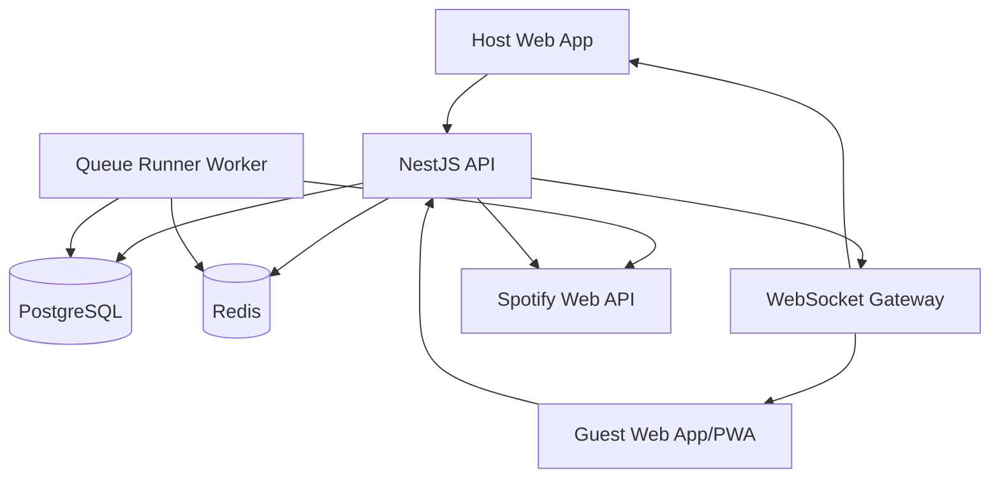

# System Architecture

## High-Level Architecture



## Main Components

### Host Web App

Used by the party host to:

- Authenticate with Spotify.
- Create session.
- Display QR code.
- Select Spotify device.
- Manage queue.
- Veto/pin tracks.
- Configure rules.
- Monitor runner health.

### Guest Web App

Used by party guests to:

- Join session.
- Search tracks.
- Suggest songs.
- Vote.
- Use free session tokens.
- See locked tracks.
- See now playing.

### API

Owns:

- Sessions.
- Guests.
- Queue entries.
- Voting.
- Tokens.
- Moderation.
- WebSocket events.
- Spotify token storage.

### Queue Runner

Owns:

- Determining next eligible track.
- Keeping Spotify queue short.
- Calling Add-to-Queue.
- Handling rate limits.
- Marking queue dispatch status.

### PostgreSQL

Durable source of truth for:

- Users.
- Sessions.
- Guests.
- Tracks.
- Queue entries.
- Votes.
- Token ledger.
- Moderation actions.
- Audit logs.

### Redis

Fast state for:

- Queue ranking.
- Lock windows.
- Rate limiting.
- Presence.
- WebSocket fanout coordination.

## Source of Truth

```text
Business truth: PostgreSQL
Ranking truth: Redis ZSET, rebuildable from PostgreSQL
Playback truth: Spotify playback state, advisory only
UI truth: API + WebSocket events
```

## Module Boundaries

```text
Spotify module: OAuth, devices, playback, queue API
Queue module: queue entries and status transitions
Scoring module: score calculation only
Lock module: lock window lifecycle
Tokens module: free session token wallet and ledger
Runner module: dispatch to Spotify
Moderation module: filters and abuse controls
WebSocket module: event broadcasting
```

## Key Design Rule

No module should both calculate queue eligibility and call Spotify.

Eligibility belongs to Queue/Scoring/Lock modules.

Spotify calls belong to Runner/Spotify modules.
